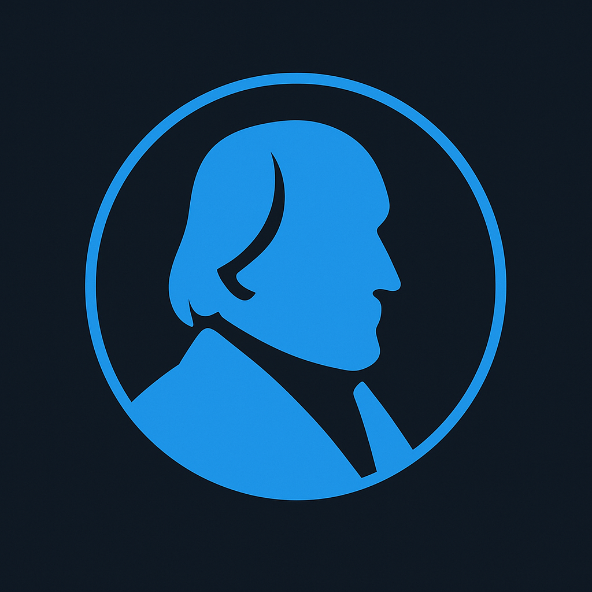

<p align="center">
  
</p>

# Dialectician AI

**Building software with clarity and speed through Dialectic-Driven Development**

Dialectician AI develops tools, methodologies, and resources for AI-assisted software development. Our core philosophy: treat code as disposable fuel while preserving clarity and architectural insight as durable value.

---

## Our Projects

### [📖 DDD Book](https://github.com/dialecticianai/ddd-book)

The comprehensive guide to Dialectic-Driven Development methodology.

**Read online:** https://dialecticianai.github.io/ddd-book/

Teaches using specs, plans, and tight feedback loops with toy models and a CLI+JSON "debugger mindset" to build software with clarity and speed.

### [🎮 ddd-nes](https://github.com/dialecticianai/ddd-nes)

NES game development demonstrating Learning meta-mode (Research ↔ Discovery).

Building an NES game from scratch to create comprehensive, AI-agent-friendly documentation of NES development.

### [⚙️ Hegel](https://github.com/dialecticianai/hegel-workspace)

Workflow orchestration tool that operationalizes DDD methodology.

**[Hegel CLI](https://github.com/dialecticianai/hegel-cli)** - State machine-based CLI for guiding structured development cycles with deterministic guardrails, metrics tracking, and real-time observability.

**[Mirror](https://github.com/dialecticianai/hegel-mirror)** - Ephemeral Markdown review UI for approving AI-generated specs and plans with inline commenting.

---

## Philosophy

### Artifacts Are Disposable, Clarity Is Durable

With AI assistance, code generation, refactoring, and even complete rewrites become cheap operations. What's valuable: architectural insights, validated constraints, and clear mental models captured in documentation.

### Three Atomic Modes

**Research Mode** - External knowledge capture, question cataloguing
**Discovery Mode** - Experimental validation, toy model discipline
**Execution Mode** - Production delivery, mandatory refactoring

### Meta-Modes: Patterns of Mode Transitions

**Learning Meta-mode** - Research ↔ Discovery ping-pong for knowledge building
**Porting Meta-mode** - Discovery → Execution with reference as oracle
**Standard Progression** - Discovery → Execution for typical development

### Economic Inversion

Traditional development: Code cheap, documentation expensive
AI-assisted development: Code cheap, **documentation still expensive but now the primary artifact**

This inversion enables:
- Test-driven development without friction
- Mandatory refactoring after every feature
- Code as validation of understanding, not final product

---

## Getting Started

### Learn the Methodology

Read the [DDD Book](https://dialecticianai.github.io/ddd-book/) to understand the methodology, workflows, and philosophy.

### Try the Tooling

Install [Hegel](https://github.com/dialecticianai/hegel-workspace) to orchestrate DDD workflows:

```bash
git clone --recursive https://github.com/dialecticianai/hegel-workspace
cd hegel-workspace
./scripts/build-and-install.sh
```

This installs both `hegel` (CLI) and `mirror` (review UI) to `~/.cargo/bin/`.

### See It in Practice

Explore [ddd-nes](https://github.com/dialecticianai/ddd-nes) for a real-world example of Learning meta-mode in action. See how systematic wiki study, question cataloguing, and toy-based validation work in practice.

---

## Community

Join our Discord to discuss DDD methodology, share experiences, and get help:

**[Join the DDD Discord](https://discord.gg/eVGgHAcMGY)**

---

## Built with DDD

Show that your project uses the DDD methodology:

```markdown
[](https://github.com/dialecticianai/ddd-book)
```

[](https://github.com/dialecticianai/ddd-book)

---

## About

Dialectician AI is dedicated to advancing AI-assisted software development through rigorous methodology, practical tooling, and open knowledge sharing.

**Core principles:**
- CLI-first, local-first (no cloud dependencies)
- Transparent, inspectable state (no black boxes)
- Deterministic guardrails (not LLM-based judgment)
- Code is machine code (natural language is the interface)
- Documents! Documents! Documents!

**Website:** [dialectician.ai](https://dialectician.ai)

---

## License

Projects under Dialectician AI use a mix of licenses:
- **DDD Book content**: Personal-Use license (no redistribution)
- **Hegel CLI & Mirror**: Server Side Public License v1 (SSPL)
- **ddd-nes**: Check repository for specific license
- **Project scaffolding/tools**: Generally MIT licensed

See individual repositories for detailed license information.

---

*Thesis, antithesis, synthesis. Let's build it.*
